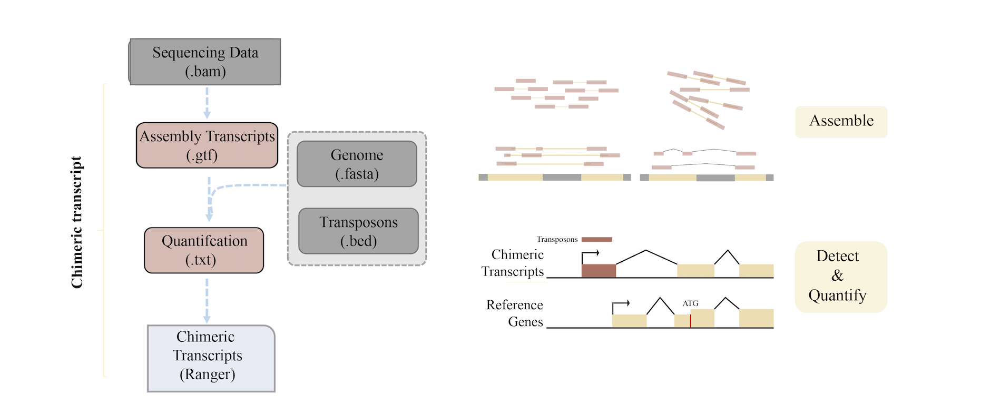

# Rstringtie
Tools for de novo transcriptome assembly from RNA sequencing data. It's used to identify new transcripts and to screen for and discover transposon-mediated chimeric transcripts.
 

# Installation
Rstringtie has been successfully installed on Mac OSX, Linux, and Windows, using the devtools package to install directly from GitHub

```
devtools::install_github("tchen-tt/Rstringtie")
```

# Contribution
Improvements and new features will be added on a regular basis, please post on the github page with any question or if you would like to contribute.


# Reference
\[1\] Pertea M, Pertea G M, Antonescu C M, et al. StringTie enables improved reconstruction of a transcriptome from RNA-seq reads[J]. Nature biotechnology, 2015, 33(3): 290-295.  
\[2\] Trapnell, C., Williams, B. A., Pertea, G., Mortazavi, A., Kwan, G., Van Baren, M. J., ... & Pachter, L. (2010). Transcript assembly and quantification by RNA-Seq reveals unannotated transcripts and isoform switching during cell differentiation. Nature biotechnology, 28(5), 511-515.  
\[3\] Shah, Nakul M., et al. "Pan-cancer analysis identifies tumor-specific antigens derived from transposable elements." Nature genetics 55.4 (2023): 631-639.  
\[4\] Modzelewski, Andrew J., Wanqing Shao, Jingqi Chen, Angus Lee, Xin Qi, Mackenzie Noon, Kristy Tjokro et al. "A mouse-specific retrotransposon drives a conserved Cdk2ap1 isoform essential for development." Cell 184, no. 22 (2021): 5541-5558. 